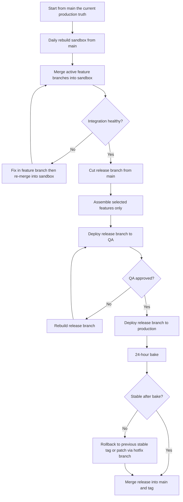
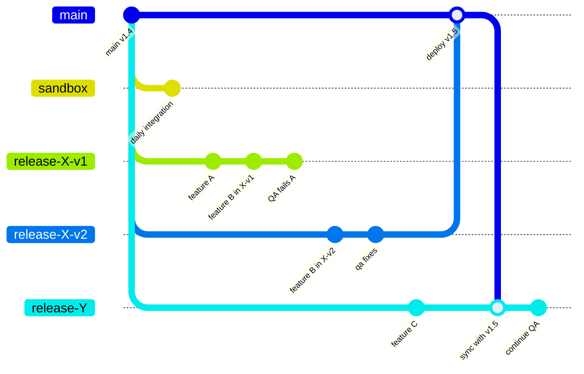

# A Release-First Git Branching Way of Working

## Why I wrote this

In this post, I share a branching approach that can work well when you need:

1. Strong release control for regulated delivery.
2. The ability to pull a feature from a release without relying on feature flags.
3. Parallel release preparation.
4. Fast integration feedback across teams.
5. Safe production fallback.

The approach is a **bespoke release-first model** with a disposable integration branch.

## Decision summary

This is not pure Trunk-Based Development or classic Git Flow.

It uses:

1. `main` as production truth.
2. `sandbox` as a throwaway integration branch rebuilt from `main` daily.
3. `release/*` branches as explicit release assembly branches.
4. `feature/*` branches for implementation.

Key principle: **features merge into release branches first, not directly into main**.

## Branches and purpose

| Branch | Role | Lifetime | Deployable |
| --- | --- | --- | --- |
| `main` | Current production truth and rollback baseline | Long-lived | Yes |
| `sandbox` | Ephemeral cross-team integration test bed | Rebuilt daily | Yes (integration only) |
| `release/*` | Curated release candidates for QA and production | Days to weeks | Yes |
| `feature/*` | Feature work branches | Short-lived where possible | No |
| `hotfix/*` | Urgent production fixes | Very short-lived | Yes (via release flow) |

## Working rules in this approach

1. `main` must represent what is running in production.
2. A release branch is cut from `main`, then assembled with selected features.
3. If a feature is pulled, we rebuild the release branch cleanly.
4. After production bake-in succeeds, merge release branch back to `main` and tag.
5. All active release branches must sync from updated `main` before production promotion.
6. Database changes are forward-only and backward-compatible (expand/contract).

## Release mechanics

## Branch interaction example

In this example, `release-X-v1` contains features A and B and fails QA because of A. A fresh branch, `release-X-v2`, is then cut from `main` and assembled with B only. Production deploys from `release-X-v2`, which makes the feature pull explicit at branch level rather than as a revert commit.

## Why this strategy can fit this context

1. **Physical feature isolation:** pulled features are removed from release code, not hidden behind toggles.
2. **Controlled parallelism:** multiple releases can be built independently from `main`.
3. **Integration confidence:** `sandbox` catches cross-team integration issues early.
4. **Operational safety:** production fallback uses known-good tags.
5. **Auditability:** release content is explicit and traceable by branch/tag history.

## Known trade-offs and how we handle them

1. **Rebase/sync tax:** when one release lands in production, other release branches must sync from `main`.
   Mitigation: scheduled sync windows and automated branch health checks.
2. **Dependency collisions between features:** one feature may require another.
   Mitigation: contract-first splits (ship inert API/contract first, then UI/behavior later).
3. **Late integration risk in release branches:** final integration happens near QA.
   Mitigation: daily `sandbox` integration and mandatory pre-QA smoke checks.

## When to consider other strategies

Choose this bespoke model when release composition control matters more than branch simplicity. Consider alternatives in these cases:

1. **Trunk-Based Development:** best when deploy frequency is very high, feature flags are mature, and releasing incomplete code safely is acceptable.
2. **GitHub Flow:** best when a small team ships continuously from a single mainline and does not need parallel curated release trains.
3. **GitLab Flow:** best when environment promotion branches are needed, but feature pull-at-code-level is less important than straightforward environment gating.
4. **Git Flow:** best when releases are infrequent, heavily versioned, and long stabilization phases are expected (for example desktop/mobile version trains).

Decision heuristic:

1. If you must remove a feature from a release without depending on flags, prefer this bespoke release-first model.
2. If you optimize for speed and low branch overhead, prefer trunk-based or GitHub Flow.
3. If you optimize for strict environment stage promotion with moderate branching complexity, prefer GitLab Flow.

## Database migration approach

This approach does not rely on rollback migrations for release safety.

Use expand and contract across releases:

1. **Expand:** add structures without removing old ones.
2. **Transition:** dual-write or dual-read where needed.
3. **Contract:** remove old structures only after all dependent code is retired.

Outcome: older release code can still run against newer schema during environment switching and rollback scenarios.

## Toulmin evaluation of this argument

### Claim

The bespoke release-first branching model is the best fit for our context.

### Data (grounds)

1. We need explicit feature pull capability without relying on runtime hiding.
2. We operate parallel release streams.
3. We require auditable, stable production fallback behavior.
4. We must support integration testing with external dependencies.

### Warrant

If release content must be explicitly controlled and reversible at code level, then release branches assembled from `main` provide stronger control than main-first models.

### Backing

1. Release branches allow explicit inclusion/exclusion and clean rebuild of release content.
2. Daily disposable integration branches reduce drift and improve early conflict detection.
3. Forward-only migration patterns are standard practice for high-availability systems.

### Qualifier

This is the preferred strategy **for our current delivery constraints** (regulated releases, explicit feature pull needs, and parallel release management).

### Rebuttals and responses

1. **Rebuttal:** This introduces branch maintenance overhead.
   **Response:** True; we accept this cost to gain explicit release control and auditability.
2. **Rebuttal:** Feature dependencies can block release independence.
   **Response:** Use contract-first decomposition to decouple dependency timing.
3. **Rebuttal:** Integration may happen too late.
   **Response:** Daily `sandbox` integration plus pre-QA gate reduces late surprises.

## Strengthened final argument

Given our need for explicit feature inclusion/exclusion, regulated release control, and safe rollback behavior, a release-first branching strategy with a disposable integration sandbox is the most reliable choice. It intentionally trades some branch maintenance overhead for higher release certainty, stronger auditability, and cleaner operational recovery.

## Suggested implementation checklist

1. Rename `develop` to `sandbox`.
2. Automate daily `sandbox` rebuild from `main`.
3. Enforce release branch cut-from-main rule in CI.
4. Add branch freshness checks for active `release/*` branches.
5. Tag every production promotion and document rollback tag.
6. Add migration linting for expand/contract compliance.
