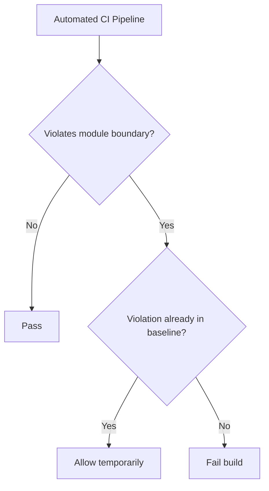
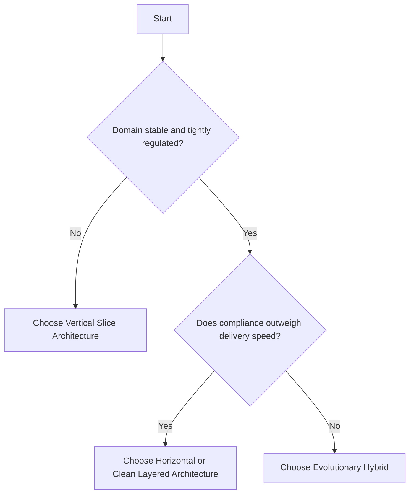

# **Vertical Slices vs Layered Architecture**

Software architecture has shifted. For decades, the dominant pattern was horizontal layering (N-tier, Onion, Clean Architecture), where systems are built sequentially from database to UI. [1] While conceptually neat, this foundation-first model creates technical friction, delays business value, and pushes integration risk to the end of delivery. [2]  
Modern teams increasingly adopt Vertical Slice Architecture (VSA), organizing code around end-to-end business capabilities. [1] Instead of designing every horizontal layer up front, they let shared layers emerge over time through deliberate "architectural gardening"—continuous pruning, consolidation, and extraction of proven patterns. [5,7]

## **Why Upfront Layering Fails**

The horizontal layered approach segregates software applications by technical specialty, placing code into distinct tiers such as presentation, application/business logic, and data access. [1] In theory, this separation of concerns is intended to isolate changes and enforce modularity. [1] In practice, however, building a system "foundation-first" introduces systemic pathologies that degrade development velocity and inflate long-term maintenance costs. [3]

### **Coupling Costs**

Business features are inherently vertical—they cut across every technical tier simultaneously. A single modification, such as adding a field to a registration form, requires coordinated edits across multiple disconnected directories: database schemas, data access repositories, business validation services, and user interface models. [4] Because layered architectures spatially separate code that must change together, this scattering increases cognitive load, introduces fragile dependencies, and escalates integration risk. Developers must understand the entire vertical cross-section of the system before committing a single change. [4]

Over the lifecycle of a system, this coupling amplifies change costs. [3] Each new layer or abstraction boundary creates another surface where changes must propagate. A simple model is:

$$
C = \frac{D}{F}
$$

where $C$ is coupling factor, $D$ is inter-component dependencies, and $F$ is independent features. In strict horizontal layering, $C$ tends to grow superlinearly as layers and abstractions accumulate, because each layer introduces coupling to adjacent layers. [3] Field studies report that changes spanning 3-4 layers often require coordination across 5-8 teams and consume 3-4x the estimated time. [3] What should take a week can consume multiple sprints of planning, coordination, and verification. [3]

### **Living Wall Analogy**

This structural rigidity mirrors the landscape architecture trend of "living walls". [14] Popularized around 2016 as a striking way to bring greenery into urban environments, these planting systems relied on complex structural supports, continuous watering, and specialized fertilization. [14] By 2026, designers have widely abandoned them—the maintenance burden, irrigation failures, and plant instability made them unsustainable. [14] Modern landscape architecture has pivoted toward "biophilic restraint": hardy, fast-growing trellised climbers that thrive naturally with minimal intervention. [14]

Both living walls and layered architectures fail for the same underlying reason: they optimize prematurely for future scenarios at the expense of present needs. Living walls assumed future aesthetic demands would justify the infrastructure cost; layered architectures assume future flexibility justifies upfront abstraction investment. Both succeed early—beautiful walls, clean diagrams—but fail mid-lifecycle when the cost of maintaining the assumed infrastructure exceeds its realized benefit. [14]

Building a massive horizontal architecture upfront over-specifies the system with premature abstractions: custom repository interfaces for databases that will never be swapped, elaborate messaging wrappers for simple synchronous calls. [5] This consumes the system's "complexity budget" on hypothetical needs rather than immediate business value, slowing onboarding, expanding the bug surface area, and trapping early-stage projects in analysis paralysis. [5]

## **Clean Architecture: Limits in Practice**

The case for layered architecture deserves direct engagement. Clean Architecture argues that strict separation of concerns improves testability, framework independence, and long-term maintainability through a rigid dependency hierarchy. [1] This is compelling, and valid in some contexts, but it does not hold for most fast-changing commercial products.

**Separation of concerns does not prevent coupling when requirements are volatile.** Clean Architecture's core claim is that separating the database from the business logic ensures changes to one won't affect the other. This holds when concerns are genuinely independent. But consider a real product requirement: order-search behavior must change based on customer segment. That rule lives in the business logic layer, but the same requirement also demands changes to the database schema (a new segment field), the caching strategy (segment-aware cache keys), and the UI filter options (a new segment dropdown). The separation of concerns did not prevent this coupling—it obscured it, dispersing related changes across layers and making them harder to localize, test, and review together. [3]

**Mocking-based testability is weaker than it appears.** Clean Architecture's dependency injection approach enables unit tests that mock data access, producing high test coverage without a running database. The implicit assumption is that unit test coverage accurately predicts production reliability. It often does not. A mock repository returns data in whatever order the test author assumed; the real database provides no such guarantee. A mock event bus silently swallows errors the real bus propagates differently. Post-mortems from production outages—including Slack's API rate-limiting incident of 2018—have traced root causes to assumptions that passed mocked unit tests but failed against real infrastructure. Vertical Slice Architecture mandates end-to-end testing with actual infrastructure (testcontainers, real databases), trading some test execution speed for accuracy. Integration failures are discovered during development, not in production. [10]

**Architectural clarity is not the same as engineering effectiveness.** Layered architectures are easier to diagram and easier to explain to senior stakeholders. This clarity has genuine psychological appeal—it feels rigorous. But engineering effectiveness is measured by speed of change, defect rates, and time-to-value, not diagram elegance. Clean Architecture optimizes for the appearance of order; VSA optimizes for the actual velocity of change.

This is not to argue that Clean Architecture is wrong for all contexts. It is demonstrably well-suited to mission-critical, regulated systems with stable requirements: aerospace, medical devices, core financial transaction processors. In those environments, requirements change infrequently, audit trails are legally required, and the cost of a late-discovered defect far exceeds any upfront architectural investment. For commercial, feature-driven products where requirements are volatile and competitive speed matters, that calculus is reversed.

## **Vertical Slices: Faster Value, Better Cohesion**

Vertical Slice Architecture (VSA) organizes code around business features and specific use cases rather than technical roles. [1] Each vertical slice is a self-contained, independent mini-application that encapsulates the entire technical stack—from the entry-point controller down to the database persistence logic—required to fulfill a distinct business request. [1]

### **High Cohesion, Low Coupling**

By keeping all components of a feature together within a single directory, VSA maximizes cohesion. [4] A developer task with updating a feature can find, modify, and test the entire workflow in one localized spot, minimizing context switching and reducing the risk of breaking unrelated functionality. [4] Deleting an obsolete feature is as simple as removing its folder, leaving no orphaned classes scattered across technical layers. [4]  
This high cohesion simplifies code navigation and testing. [4] Instead of relying on brittle unit tests that mock out heavily abstracted internal repositories, teams test vertical slices end-to-end. [10] By establishing a predictable database state using test containers, sending an HTTP request directly to the slice’s API endpoint, and asserting on the response and database state, developers achieve high coverage of real system behavior with minimal test maintenance overhead. [10]

### **MLP and UX Slices**

This architectural style directly supports modern agile product delivery. [1] Rather than focusing on a skeletal Minimum Viable Product (MVP) that only validates technical feasibility, teams prioritize delivering a "Most Loved Product" (MLP). [13] A true MLP vertical slice does not merely represent a slice of the technical database-to-UI stack; it must also cut across the user experience spectrum, integrating functional, reliable, usable, and emotional design layers. [13]  
This ensures that the feature is capable of eliciting user delight and gathering meaningful behavioral feedback immediately, allowing the team to validate business hypotheses in weeks rather than months. [2] This approach aligns engineering directly with Conway's Law. [2] Instead of separating developers into specialized, siloed frontend, backend, and database teams, VSA supports cross-functional, autonomous squads that own a business capability from end to end. [1]

### **Trade-Offs of Vertical Slices**

Despite its advantages, VSA is not without engineering trade-offs. [18] Organizing an application strictly around use cases can make intra-module refactoring and static analysis more difficult. [18] Because the code for a single logical domain concept is distributed across multiple vertical slices, ensuring consistent validation, data integrity, and cross-cutting behaviors requires deliberate discipline. [18] If left unmanaged, VSA can lead to localized code duplication, an anemic domain model, and inconsistent folder structures across features, potentially degrading into a chaotic, fragmented system. [4]

The key trade-off is risk type. In VSA, duplication is visible and governable: teams can apply explicit sharing rules (the three-tier model below) and enforce them with architecture fitness tests. Companies like Amazon and Shopify report that domain duplication typically stabilizes around 15-25% after 18-24 months, with the rest being genuinely independent feature logic. [26] In contrast, layered coupling compounds as systems scale.

VSA problems (duplication, inconsistency) are usually detectable and correctable during development through code review, static analysis, and team discipline. Layered-architecture problems (hidden coupling, integration risk) often surface late in integration, when fixes are far more expensive. That asymmetry matters: VSA tends to create manageable friction, while rigid layering can create structural bottlenecks.

## **Architectural Gardening**

Software is a soft, living medium. [6] Traditional engineering analogies borrowed from physical construction—which assume that architecture is a static foundation defined once at the start by an all-knowing master planner—fail because programming is an ongoing design process, not a construction phase. [6] The source code itself is the only true design blueprint; physical "construction" (compiling and linking) is free and instantaneous. [6]  
Therefore, software architecture is not static; it grows and evolves daily with every line of code added or changed. [6] Without continuous care, a codebase naturally succumbs to systemic entropy, scope creep, and technical rot. [9]

### **The Gardener Architect**

This reality reframes the role of the software architect from an "Empire Builder" to a "Gardener". [6] The Empire Builder, resembling the French formal gardeners of Versailles, seeks to impose absolute order over nature, forcing trees into unnatural, geometric shapes and demanding complete adherence to a rigid, top-down plan. [7] When applied to large IT projects, this authoritarian master planning fails because architects make critical decisions based on outdated, highly filtered PowerPoint decks rather than ground-level technical reality. [7]  
The Gardener, reflecting the philosophy of a Japanese Zen garden, acts as an active participant inside the ecosystem. [7] The gardener-architect does not fight the natural growth and communication pathways of the development teams. [7] Instead, they embrace the flow, working within feature teams to guide, prune, and maintain balance from within. [6]

| | Empire Builder (Versailles Model) | Caretaker (Zen Garden Model) |
| :--- | :--- | :--- |
| **Role** | Dictatorial master planner | Active participant inside the ecosystem |
| **Method** | Imposes geometric order from above (BDUF) | Guides natural communication and value flows |
| **Approach to structure** | Forces features into rigid, pre-built layers | Prunes redundant paths; consolidates emerging patterns |
| **Feedback cycle** | High latency; prone to catastrophic failure | Short loops; highly adaptive and resilient |

### **How Horizontal Layers Emerge**

Rather than building horizontal layers first, horizontal layering must be an evolutionary outcome achieved through constant gardening. [5] In the early phases of a project, the priority is to get to value quickly by delivering independent vertical slices. [1] Developers construct a "Walking Skeleton" using "Tracer Code"—a thin, end-to-end implementation of a customer-centric feature—to establish deployment pipelines, database connections, and basic communication paths. [6]  
As more vertical slices are planted, common patterns, shared technical requirements, and related business invariants inevitably emerge. [9] This is the precise moment where gardening occurs: the architect-gardener works with the teams to prune the duplicates, extract shared logic, and consolidate related components into cohesive horizontal layers. [7] Horizontal layering is thus grown, not built, ensuring that abstractions are only introduced to solve actual, observed problems rather than speculative, hypothetical ones. [5]  
An exception to a pure vertical start exists in highly complex environments, such as data science or massive system modernizations involving legacy mainframes. [24] In a churn prediction or data mining project, for example, an extensive base layer—such as bulk data collection, pipeline setup, or core database infrastructure—is often executed as a horizontal slice during an initial "Sprint 0". [22] Once this basic horizontal landing pad is established, development pivots to delivering rapid, customer-centric vertical slices on top. [24]

## **2026 Reference: Modular Monoliths**

The tension between rapid feature delivery and structural integrity is central to the "microservices regression" observed in 2026. [26] Many organizations adopted microservices on the premise that distributed architecture would deliver independence and scalability. In practice, the operational complexity of managing 50-200 services, the latency introduced by service-to-service calls, and the difficulty of distributed debugging consumed those benefits entirely. The result: 42% of organizations have consolidated their microservices back into "Modular Monoliths". [26] This consolidated form maintains the operational simplicity of a single deployable unit while enforcing explicit, strict domain boundaries between modules. [26] This shift is supported by modern toolchains, including Spring Modulith 1.4 GA, ArchUnit 1.3, and jMolecules 2026.0.26

This consolidation validates a key VSA principle: logical separation can be enforced without physical distribution. Microservices assumed separate databases, servers, and deployment pipelines were necessary to achieve module independence. The 2026 consolidation demonstrates that assumption was wrong—teams can achieve equivalent logical boundaries through modular monoliths with architecture fitness functions, gaining the independence benefits without the operational cost.

### **Fitness Functions**

To ensure an evolving architecture does not degrade into a chaotic "ball of mud," teams implement automated Architecture Fitness Functions. [26] These tests enforce structural rules the same way unit tests enforce business behavior. [26]  
In ArchUnit 1.3, `FreezingArchRule` makes this practical for legacy systems. [26] It records current violations as a baseline, allows historical violations temporarily, and blocks new ones. This lets teams refactor incrementally during normal feature delivery instead of attempting a high-risk rewrite. [10]

### **Evolutionary Monolith Blueprint**

An enterprise seeking to adopt this evolutionary path in 2026 should utilize a standardized modular engineering checklist:

* **Model the Domain First:** Use strategic Domain-Driven Design (DDD) to identify bounded contexts and map out the core domain entities. [17]  
* **Establish Module Skeletons:** Define distinct module folders using jMolecules annotations or Spring Modulith configurations to represent the boundaries. [26]  
* **Write Architecture Fitness Tests:** Integrate ArchUnit tests directly into the build pipeline, enforcing that vertical slices or domain modules remain decoupled. [26]  
* **Prefer Asynchronous Communication:** Use Spring Modulith’s event-first communication or transaction outbox patterns to handle cross-module side effects, preventing runtime coupling. [23]  
* **Auto-Generate Visual Documentation:** Leverage Modulith's C4 diagram generation tools to automatically output actual, live system architecture diagrams directly from the codebase, ensuring documentation never drifts from reality. [20]

## **Pragmatic Duplication and Shared-Code Traps**

The primary risk when transitioning to a Vertical Slice Architecture is the "Hexagonal Transition Trap" or "Shared Folder Trap". [4] Developers transitioning from Onion, Hexagonal, or Clean architectures are often deeply uncomfortable with code duplication and have been trained to enforce strict separation between technical concerns. [1]  
Consequently, they carry over an outdated mindset: they prematurely create a global "Core" or "Shared" folder early in the project lifecycle, placing domain rules, value objects, shared services, and database schemas there. [4] This leaks business logic and creates an unstructured common dumping ground. [4] It reintroduces the heavy coupling of layered architectures, ensuring that a change in one feature's domain rules accidentally breaks or alters another feature. [4]

### **WET and the Rule of Three**

To maintain feature independence, VSA demands a paradigm shift: teams must prefer the WET (Write Everything Twice) principle at the start. [15] Localized code duplication is accepted as the price of changeability and speed. [15] Request models, response models (DTOs), and workflow validation rules should be duplicated across slices to prevent features from becoming entangled. [15]  
If a change is required in how an order is searched, modifying the SearchProductDto should not impact the GetProductDto, even if both models are structurally identical today. [15] Only when identical, stable logic is implemented across three or more slices is the "Rule of Three" applied, and the logic safely extracted to a shared module. [15]

### **Shared Code Governance**

To assist developers in navigating this tension, a strict three-tiered sharing governance model should be enforced in the codebase [4]:

| Governance Tier | Core Definition | Allowable Components | Architectural Rule |
| :---- | :---- | :---- | :---- |
| **Tier 1: Technical Infrastructure** | Cross-cutting technical plumbing that has no direct business meaning. [15] | Database context factories, event buses, logging adapters, authentication middleware, serialization options, ID generators, clock utilities. [4] | **Share Freely:** Centralize in a global Infrastructure layer. [15] These components change only when technical libraries are upgraded, not when business requirements shift. [15] |
| **Tier 2: Domain Concepts** | Stable, core business concepts and rules that span the entire bounded context. [4] | Domain entities, value objects (e.g., Money, Email), domain events, and core domain services. [15] | **Push Down to Domain:** Share only by encapsulating business invariants inside rich domain entities. [15] If a business rule must be shared, place it on the entity itself via rich domain methods rather than duplicating the logic across slice handlers. [15] |
| **Tier 3: Feature-Specific Logic** | The specific application workflow and orchestration logic unique to a single use case. [15] | Command and Query handlers, request payloads, response DTOs, endpoint controllers, and feature-specific validation schemas. [11] | **Keep Strictly Local:** House exclusively inside the feature slice folder. [4] Local sharing is permitted only within a single, highly related "Feature-Family" folder (e.g., Features/Orders/Shared/) to support local helper methods. [15] |

## **Architecture Comparison Framework**

To assist systems architects and product leaders in determining the optimal design strategy, this section establishes a formal comparative framework.

### **Side-by-Side Matrix**

The table below contrasts the horizontal layered approach, pure vertical feature slicing, and the recommended evolutionary modular monolith hybrid model across critical operational, financial, and organizational dimensions:

| Architectural Dimension | Horizontal Layered (Clean/Onion) | Vertical Feature Slices (VSA) | Evolutionary Modular Monolith |
| :---- | :---- | :---- | :---- |
| **Time-to-Value Delivery** | **Slow:** Requires building multiple foundational layers before delivering any user-facing capability. [2] | **Rapid:** Focuses on shipping thin, end-to-end features immediately to gather early user feedback. [2] | **Balanced:** Delivers rapid feature slices while continuously extending a stable, shared architectural runway. [28] |
| **Feedback Loop Latency** | **High:** Integration errors are discovered late in the cycle, leading to high-cost late-stage rework. [2] | **Low:** Features are integrated, deployed, and validated by real users within weeks. [2] | **Low:** Continuous integration and automated system demos provide fast validation of domain boundaries. [26] |
| **Risk of Overengineering** | **Very High:** Encourages premature abstraction and complex pattern implementation for hypothetical scale. [5] | **Minimal:** Abstractions are avoided, allowing developers to query databases directly in the handlers. [12] | **Moderate:** Controlled through enabler prioritization and automated architecture fitness tests. [26] |
| **Refactoring Complexity** | **Moderate:** Standardized layers provide clear guardrails, but simple changes require touching multiple tiers. [3] | **High at Scale:** Dispersed logic and duplicated workflows can make cross-feature refactoring highly expensive. [18] | **Low:** Clear domain boundaries and automated compiler-enforced tests make internal refactoring safe. [26] |
| **Conway's Law Alignment** | **Poor:** Promotes organizational silos divided by technical specialty (frontend, database, etc.). [2] | **Excellent:** Supports cross-functional, autonomous squads that own a feature from end to end. [1] | **Excellent:** Aligns teams with distinct domain boundaries (bounded contexts) and system-level flows. [17] |
| **Onboarding Velocity** | **Slow:** New hires must master the entire application's layered architecture and abstractions before contributing. [5] | **Rapid:** New developers can own, modify, and deploy a single slice with minimal system context. [10] | **Balanced:** Developers focus on a single module while relying on a pre-built, documented architectural runway. [10] |

## **How to Choose**

The decision of which architectural style to use should be guided by clear criteria:

### **Choose Vertical Slices When**

Organizations should choose Vertical Slice Architecture when speed-to-market, rapid validation, and development velocity are the highest organizational priorities. [1] In these contexts, discovering integration failures late—a structural risk of layered architecture—is more costly than managing code duplication, which VSA controls through explicit governance. This is particularly true for:

* Early-stage startups, entrepreneurial environments, and greenfield projects where requirements are volatile and the business model is still being validated. [2] In volatile contexts, layered coupling compounds faster than duplication cost—because the team is making changes constantly.
* Small-to-medium-sized systems with relatively simple business rules, where layered architecture's fixed cognitive overhead exceeds the abstraction benefit. [18]
* Product-focused organizations that employ cross-functional squads and prioritize building a "Most Loved Product" to gather early feedback. [1]  
* Modern web and mobile application backends that rely heavily on MediatR pipelines and minimal APIs, where keeping handlers simple and co-located improves the developer experience. [11]

### **Choose Layered Architecture When**

While VSA is highly performant for modern feature delivery, a structured horizontal layered approach is preferred in specific, well-defined contexts:

* **Highly regulated, mission-critical, and safety-critical environments**—such as aerospace, healthcare diagnostic systems, or core financial transaction processors—where requirements are locked down and architectural changes post-deployment carry regulatory penalties. [2] In these contexts, the cost of a late-discovered defect exceeds the cost of any upfront architectural investment; layered architecture's strict separation provides audit trails, traceability, and enforced review gates that these domains legally require.
* Pure infrastructure, developer platform, or utility library projects without direct business features, where technical modularity is the primary deliverable. [2] These projects have stable, well-understood requirements and benefit from the composability and plugin architecture that layered design enables.
* Large-scale systems with massive, complex, and highly stable domain rules, where compile-time architectural guardrails are necessary to prevent regressions across a very large developer base. [1] At extreme scale—hundreds of developers—enforced separation provides governance benefits that can outweigh the coupling overhead.

### **Choose the Hybrid Monolith When**

For mid-to-large-scale enterprise applications, the optimal strategy is a hybrid approach. [26] Organizations should balance emergent design with intentional architecture. [25]  
In this model, development teams deliver features using vertical slices to get to value quickly, while a dedicated system architect continuously gardens the system. [1] They fund an "Architectural Runway" by prioritizing technical "Enablers"—such as robust API gateways, shared security compliance engines, and automated test containers—ensuring that the rapid, vertical feature deliveries land safely on a stable, evolving common foundation. [28]

#### **Sources**

[1]. Vertical Slice Architecture and Comparison with Clean Architecture | by Mehmet Ozkaya, accessed on May 29, 2026, [https://mehmetozkaya.medium.com/vertical-slice-architecture-and-comparison-with-clean-architecture-76f813e3dab6](https://mehmetozkaya.medium.com/vertical-slice-architecture-and-comparison-with-clean-architecture-76f813e3dab6)  
[2]. What is a Vertical Slice? The Guide to Agile, Architecture & Value, accessed on May 29, 2026, [https://monday.com/blog/rnd/vertical-slice/](https://monday.com/blog/rnd/vertical-slice/)  
[3]. The Hidden Costs of Poor Software Architecture and How to Avoid Them | April9, accessed on May 29, 2026, [https://april9.com.au/blog/hidden-costs-poor-software-architecture](https://april9.com.au/blog/hidden-costs-poor-software-architecture)  
[4]. Vertical Slice Architecture. It is common to build backend… | by iamprovidence | May, 2026 | Medium, accessed on May 29, 2026, [https://medium.com/@iamprovidence/vertical-slice-architecture-e3b7b8f48ce9](https://medium.com/@iamprovidence/vertical-slice-architecture-e3b7b8f48ce9)  
[5]. Common Software Architecture Mistakes and How to Avoid Them | Engineering Leadership Guide \- Ruchit Suthar, accessed on May 29, 2026, [https://ruchitsuthar.com/blog/software-craftsmanship/common-software-architecture-mistakes-to-avoid/](https://ruchitsuthar.com/blog/software-craftsmanship/common-software-architecture-mistakes-to-avoid/)  
[6]. Architecture & Design \- LeSS, accessed on May 29, 2026, [https://less.works/less/technical-excellence/architecture-design](https://less.works/less/technical-excellence/architecture-design)  
[7]. Architecture is gardening. | Soldier's 5, accessed on May 29, 2026, [https://4lex.nz/posts/architecture-practice-1-gardeners/](https://4lex.nz/posts/architecture-practice-1-gardeners/)  
[8]. EVOLUTIONARY ARCHITECTURE:24P RINCIPLES OF EMERGENT,ORGANIC,AND HIGHLY ADAPTIVE DESIGN, accessed on May 29, 2026, [https://davidfrico.com/evolutionary-architecture-principles.pdf](https://davidfrico.com/evolutionary-architecture-principles.pdf)  
[9]. Gardening \- Cultivating Better Software \- DEV Community, accessed on May 29, 2026, [https://dev.to/htissink/gardening-cultivating-better-software-4kll](https://dev.to/htissink/gardening-cultivating-better-software-4kll)  
[10]. Vertical Slice Architecture for Web Apps | Clean Code Guy, accessed on May 29, 2026, [https://cleancodeguy.com/blog/vertical-slice-architecture](https://cleancodeguy.com/blog/vertical-slice-architecture)  
[11]. Vertical Slice Architecture — Software Architecture Part 5 | by Piyush Doorwar | Mr. Plan ₿ Publication | Medium, accessed on May 29, 2026, [https://medium.com/mr-plan-publication/vertical-slice-architecture-software-architecture-part-5-102db9331d16](https://medium.com/mr-plan-publication/vertical-slice-architecture-software-architecture-part-5-102db9331d16)  
[12]. Vertical Slice Architecture in .NET | by Adrian Bailador \- Medium, accessed on May 29, 2026, [https://medium.com/@adrianbailador/vertical-slice-architecture-in-net-be1365d7f0a6](https://medium.com/@adrianbailador/vertical-slice-architecture-in-net-be1365d7f0a6)  
[13]. AgileAfrica | Reflections of a Scrum Master, accessed on May 29, 2026, [https://dozylocal.wordpress.com/tag/agileafrica/](https://dozylocal.wordpress.com/tag/agileafrica/)  
[14]. The Decade-Old Garden Trend Designers Are Happily Leaving in the Past (And 1 Idea We Love That's Replacing It), accessed on May 29, 2026, [https://www.homesandgardens.com/gardens/the-decade-old-garden-trend-designers-are-happily-leaving-in-the-past](https://www.homesandgardens.com/gardens/the-decade-old-garden-trend-designers-are-happily-leaving-in-the-past)  
[15]. How to Avoid Code Duplication in Vertical Slice Architecture in .NET, accessed on May 29, 2026, [https://antondevtips.com/blog/how-to-avoid-code-duplication-in-vertical-slice-architecture-in-dotnet](https://antondevtips.com/blog/how-to-avoid-code-duplication-in-vertical-slice-architecture-in-dotnet)  
[16]. Vertical Slice Architecture in .NET | Adrian Bailador, accessed on May 29, 2026, [https://adrianbailador.github.io/blog/47-vertical-slice-architecture/](https://adrianbailador.github.io/blog/47-vertical-slice-architecture/)  
[17]. Why Vertical Slice Architecture is the Key to Modernizing Insurance Systems, accessed on May 29, 2026, [https://info.praxent.com/blog/why-vertical-slice-architecture-is-the-key-to-modernizing-insurance-systems](https://info.praxent.com/blog/why-vertical-slice-architecture-is-the-key-to-modernizing-insurance-systems)  
[18]. Vertical Slice Architecture: A Balanced Evaluation \- DEV Community, accessed on May 29, 2026, [https://dev.to/arthus15/vertical-slice-architecture-a-balanced-evaluation-1i3f](https://dev.to/arthus15/vertical-slice-architecture-a-balanced-evaluation-1i3f)  
[19]. What are the fundamental tools used by software architects to manage complexity? \- Reddit, accessed on May 29, 2026, [https://www.reddit.com/r/softwarearchitecture/comments/ydisys/what\_are\_the\_fundamental\_tools\_used\_by\_software/](https://www.reddit.com/r/softwarearchitecture/comments/ydisys/what_are_the_fundamental_tools_used_by_software/)  
[20]. large-scale agile design and architecture ways of working \- sample chapter \- InfoQ, accessed on May 29, 2026, [https://res.infoq.com/articles/large-scale-agile-design-and-architecture/en/resources/large-scale%20agile%20design%20and%20architecture%20ways%20of%20working%20-%20sample%20chapter%20-%20larman%20and%20vodde.pdf](https://res.infoq.com/articles/large-scale-agile-design-and-architecture/en/resources/large-scale%20agile%20design%20and%20architecture%20ways%20of%20working%20-%20sample%20chapter%20-%20larman%20and%20vodde.pdf)  
[21]. What Is Scope Creep in Agile? Causes & How to Manage It \- Talent500, accessed on May 29, 2026, [https://talent500.com/blog/scope-creep-in-agile-projects/](https://talent500.com/blog/scope-creep-in-agile-projects/)  
[22]. Architecture and Design Practices for Agile Project Management, accessed on May 29, 2026, [https://www.projectmanagement.com/articles/274313/Architecture-and-Design-Practices-for-Agile-Project-Management](https://www.projectmanagement.com/articles/274313/Architecture-and-Design-Practices-for-Agile-Project-Management)  
[23]. Vertical Slice Architecture: Where Does the Shared Logic Live?, accessed on May 29, 2026, [https://www.milanjovanovic.tech/blog/vertical-slice-architecture-where-does-the-shared-logic-live](https://www.milanjovanovic.tech/blog/vertical-slice-architecture-where-does-the-shared-logic-live)  
[24]. Vertical vs Horizontal Slicing Data Science Deliverables, accessed on May 29, 2026, [https://www.datascience-pm.com/vertical-vs-horizontal-slicing-data-science-deliverables/](https://www.datascience-pm.com/vertical-vs-horizontal-slicing-data-science-deliverables/)  
[25]. Establishing Architecture for Large Enterprise Solutions in Agile Environment – IJERT, accessed on May 29, 2026, [https://www.ijert.org/establishing-architecture-for-large-enterprise-solutions-in-agile-environment](https://www.ijert.org/establishing-architecture-for-large-enterprise-solutions-in-agile-environment)  
[26]. The Modular Monolith 2026 Complete Guide — Spring Modulith, ArchUnit Fitness Functions, and Lessons from Shopify's 30TB/min Architecture \- DEV Community, accessed on May 29, 2026, [https://dev.to/x4nent/the-modular-monolith-2026-complete-guide-spring-modulith-archunit-fitness-functions-and-lessons-878](https://dev.to/x4nent/the-modular-monolith-2026-complete-guide-spring-modulith-archunit-fitness-functions-and-lessons-878)  
[27]. Supporting Large-Scale Agile Development with Domain-driven Design \- Department of Computer Science, accessed on May 29, 2026, [https://www.cs.cit.tum.de/fileadmin/w00cfj/sebis/publications/Ul18a.pdf](https://www.cs.cit.tum.de/fileadmin/w00cfj/sebis/publications/Ul18a.pdf)  
[28]. Essential SAFe® | Planview LeanKit, accessed on May 29, 2026, [https://www.planview.com/resources/guide/scaled-agile-framework-how-technology-enables-agility/essential-safe/](https://www.planview.com/resources/guide/scaled-agile-framework-how-technology-enables-agility/essential-safe/)  
[29]. Balancing Emergent Design and Intentional Architecture in SAFe | Agile Seekers, accessed on May 29, 2026, [https://agileseekers.com/blog/balancing-emergent-design-and-intentional-architecture-in-safe](https://agileseekers.com/blog/balancing-emergent-design-and-intentional-architecture-in-safe)  
[30]. After 24 years of building systems, here are the architecture mistakes I see startups repeat : r/softwarearchitecture \- Reddit, accessed on May 29, 2026, [https://www.reddit.com/r/softwarearchitecture/comments/1rh4mbf/after\_24\_years\_of\_building\_systems\_here\_are\_the/](https://www.reddit.com/r/softwarearchitecture/comments/1rh4mbf/after_24_years_of_building_systems_here_are_the/)  
[31]. SAFe System Architect Role: Responsibilities & Career Path \- Skillify Solutions, accessed on May 29, 2026, [https://skillifysolutions.com/blogs/safe/safe-system-architect-role/](https://skillifysolutions.com/blogs/safe/safe-system-architect-role/)  
[32]. Architecting Success: Balancing Big Design Up Front and Emergent Design in Software, accessed on May 29, 2026, [https://shukriev.medium.com/architecting-success-balancing-big-design-up-front-and-emergent-design-in-software-f11978469636](https://shukriev.medium.com/architecting-success-balancing-big-design-up-front-and-emergent-design-in-software-f11978469636)  
[33]. SAFe and Enterprise Architecture explained in 5 points, accessed on May 29, 2026, [https://www.architectureandgovernance.com/elevating-ea/safe-and-enterprise-architecture-explained-in-5-points/](https://www.architectureandgovernance.com/elevating-ea/safe-and-enterprise-architecture-explained-in-5-points/)

