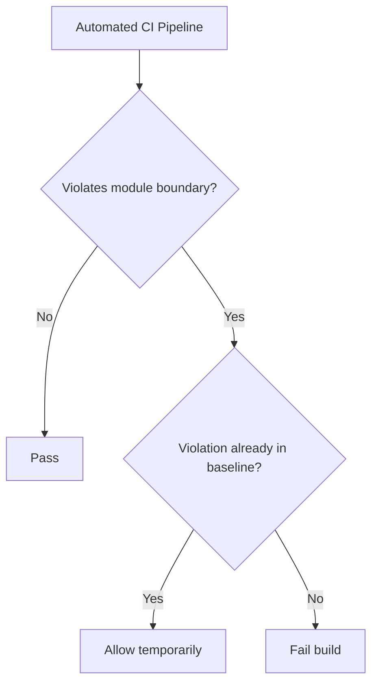
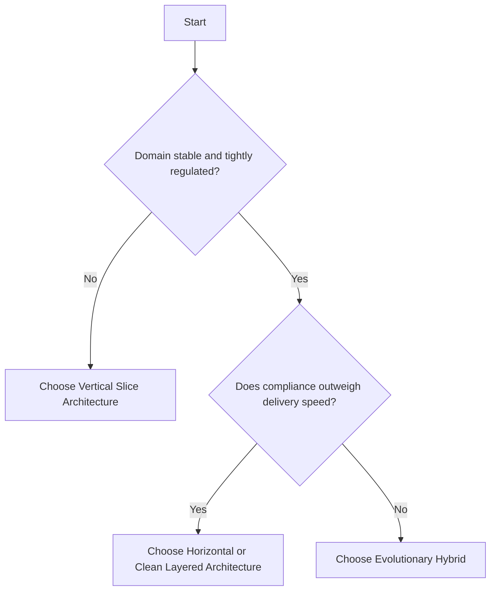

# Vertical Slices vs Layered Architecture

Two common ways of organising software are layered architecture and vertical slices. Layered architecture groups code by technical job: web pages, business logic, and database access. Vertical Slice Architecture (VSA) groups code by the user action it supports: placing an order, changing an address, or issuing a refund.

The difference is easiest to see in an online shop. In a layered system, the code for “place order” is spread across several folders. In a vertical-slice system, most of that code lives together. The aim is not to avoid structure. It is to put structure where the team makes changes.

## Why Upfront Layering Fails

In a layered system, code is separated by technical specialty. A typical shop might look like this:

```text
Controllers/OrderController.cs
Services/OrderService.cs
Repositories/OrderRepository.cs
Models/Order.cs
Database/Orders.sql
```

This layout is tidy, but one feature is spread across the whole application. A change to the order form may require edits in the controller, service, database model, repository, and UI model. The layers are separate, but the work is still connected.

### Coupling Costs

Business features usually cross every technical tier. For example, adding a “delivery instructions” field to checkout may require a form change, validation, a database column, an API response, and an order confirmation email. When those pieces are spread across the application, a developer has to search widely and remember more of the system before making a small change.

Over time, this can make changes more expensive. Each extra abstraction is another place where a change may need to be passed through. A simple way to express the idea is:

$$
C = \frac{D}{F}
$$

where $C$ is a rough coupling factor, $D$ is the number of dependencies between components, and $F$ is the number of independent features. This is a thinking tool, not a measured law. The point is simple: if one feature touches many shared layers, the cost of changing it tends to rise.

### Living Wall Analogy

This is similar to building a garden with an elaborate watering system before knowing which plants will survive. The design may look impressive at first, but the maintenance cost can become larger than the benefit. Upfront architecture can have the same problem: it solves imagined future needs before the team understands the real ones.

Building every layer up front can also create abstractions for problems that never arrive. A team may create a repository interface because the database might one day change, or a messaging wrapper for a call that will remain local. That work uses time and adds places for bugs before the product has proved what it needs.

## Clean Architecture: Limits in Practice

The case for layered architecture deserves direct engagement. Clean Architecture argues that strict separation of concerns improves testability, framework independence, and long-term maintainability through a rigid dependency hierarchy. This is compelling, and valid in some contexts, but it does not hold for most fast-changing commercial products.

**Separation of concerns does not prevent coupling when requirements are volatile.** Clean Architecture's core claim is that separating the database from the business logic ensures changes to one won't affect the other. This holds when concerns are genuinely independent. But consider a real product requirement: order-search behavior must change based on customer segment. That rule lives in the business logic layer, but the same requirement also demands changes to the database schema (a new segment field), the caching strategy (segment-aware cache keys), and the UI filter options (a new segment dropdown). The separation of concerns did not prevent this coupling—it obscured it, dispersing related changes across layers and making them harder to localize, test, and review together.

**Mocking-based testability is weaker than it appears.** Clean Architecture's dependency injection approach enables unit tests that mock data access, producing high test coverage without a running database. The implicit assumption is that unit test coverage accurately predicts production reliability. It often does not. A mock repository returns data in whatever order the test author assumed; the real database provides no such guarantee. A mock event bus silently swallows errors the real bus propagates differently. Post-mortems from production outages—including Slack's API rate-limiting incident of 2018—have traced root causes to assumptions that passed mocked unit tests but failed against real infrastructure. Vertical Slice Architecture mandates end-to-end testing with actual infrastructure (testcontainers, real databases), trading some test execution speed for accuracy. Integration failures are discovered during development, not in production.

**Architectural clarity is not the same as engineering effectiveness.** Layered architectures are easier to diagram and easier to explain to senior stakeholders. This clarity has genuine psychological appeal—it feels rigorous. But engineering effectiveness is measured by speed of change, defect rates, and time-to-value, not diagram elegance. Clean Architecture optimizes for the appearance of order; VSA optimizes for the actual velocity of change.

Clean Architecture is not wrong for every context. It can be a good fit for regulated and safety-critical systems such as medical devices, aircraft systems, or core banking. Those systems need traceability, strict review, and predictable change. For a product whose requirements are changing every week, the cost-benefit calculation may be different.

## Vertical Slices: Faster Value, Better Cohesion

Vertical Slice Architecture organizes code around business features and specific user actions. A slice contains the code needed to handle one request from start to finish.

For the shop example, the structure might be:

```text
Features/
      Orders/
            PlaceOrder/
                  PlaceOrderEndpoint.cs
                  PlaceOrderRequest.cs
                  PlaceOrderHandler.cs
                  PlaceOrderValidator.cs
                  PlaceOrderTests.cs
            CancelOrder/
                  CancelOrderEndpoint.cs
                  CancelOrderHandler.cs
                  CancelOrderTests.cs
```

When the checkout rules change, the developer starts in `Features/Orders/PlaceOrder`. The handler can call the database directly or use a small local helper. There is no requirement to create a shared service and repository before the feature can work.

### High Cohesion, Low Coupling

Keeping a feature together makes it easier to find, change, and test. Removing an obsolete feature is also easier because its code is less likely to be scattered across unrelated folders.

Testing can follow the same path as a real user. Start a temporary database, send `POST /orders`, and check both the HTTP response and the saved order. This is an end-to-end test: it checks the complete feature instead of replacing every dependency with a mock. Testcontainers is one tool teams use to create temporary databases for this purpose.

### MLP and UX Slices

This approach supports small, useful releases. A Minimum Viable Product (MVP) proves that something can work. A “Most Loved Product” (MLP) tries to make the complete experience useful and pleasant from the first release. For checkout, that means more than saving an order: it also includes clear error messages, a reliable confirmation, and a workable mobile form.

It also fits Conway’s Law: teams tend to build systems that reflect how they are organised. A team that owns orders from the screen to the database is more likely to produce a coherent order feature than separate frontend, backend, and database teams passing work between one another.

### Trade-Offs of Vertical Slices

VSA has trade-offs. The same concept may appear in several slices. For example, `PlaceOrder` and `Reorder` may each need to validate an address. That duplication is sometimes useful because the two workflows may change independently, but it can also become inconsistent if nobody reviews it.

Teams need naming rules, code review, automated checks, and a clear policy for shared code. Without those controls, a VSA codebase can become fragmented and difficult to refactor.

The key trade-off is risk type. In VSA, duplication is visible and governable: teams can apply explicit sharing rules (the three-tier model below) and enforce them with architecture fitness tests. Companies like Amazon and Shopify report that domain duplication typically stabilizes around 15-25% after 18-24 months, with the rest being genuinely independent feature logic. In contrast, layered coupling compounds as systems scale.

VSA problems (duplication, inconsistency) are usually detectable and correctable during development through code review, static analysis, and team discipline. Layered-architecture problems (hidden coupling, integration risk) often surface late in integration, when fixes are far more expensive. That asymmetry matters: VSA tends to create manageable friction, while rigid layering can create structural bottlenecks.

## Architectural Gardening

Software architecture changes as the product changes. A diagram made at the start is a plan, not a permanent truth. The code is the design that the team must keep improving. Without regular care, shortcuts accumulate and the structure becomes harder to understand.

### The Gardener Architect

This changes the architect’s role. Instead of trying to design every detail in advance, the architect helps teams make good local decisions and removes structures that no longer help. The architect watches for repeated problems, helps teams agree on boundaries, and makes useful patterns easier to reuse.

| | Empire Builder (Versailles Model) | Caretaker (Zen Garden Model) |
| :--- | :--- | :--- |
| **Role** | Designs everything in advance | Helps teams improve the system over time |
| **Method** | Sets a rigid plan from above | Uses feedback from working software |
| **Approach to structure** | Forces every feature into the same layers | Shares patterns after they prove useful |
| **Feedback cycle** | Slow; problems appear late | Short; problems appear during delivery |

### How Horizontal Layers Emerge

The team can let shared layers emerge from real work. Start with one small end-to-end feature, such as placing an order. That first feature proves that the application can accept a request, write to the database, deploy, and show a useful result. This is often called a walking skeleton: a very thin version of the whole system.

After several features, repeated patterns become easier to see. If three workflows need the same reliable payment adapter, that adapter may belong in shared infrastructure. If only two workflows happen to have similar validation today, keeping the code local may be safer. The rule is to share code because a real pattern has appeared, not because it might appear later.

Some projects need a technical foundation first. A data platform may need a storage and pipeline layer before users can receive a prediction. A mainframe modernisation may need a reliable connection to the old system before new features can be delivered. Even then, the team should move to useful end-to-end features as soon as the foundation is workable.

## Reference: Modular Monoliths

As systems grow, teams often face a choice between one large application and many separately deployed services. A modular monolith keeps one deployable application but divides its code into modules with clear boundaries. For an online shop, `Orders`, `Payments`, and `Shipping` might be separate modules even though they are released together.

This can provide much of the logical separation people want from microservices without requiring a separate server, database, deployment pipeline, and monitoring setup for every module. If a module later needs independent scaling or deployment, it has a clearer starting boundary.

The important distinction is logical separation versus physical separation. Code can have strict boundaries without running every boundary as its own service. That is often a simpler place to start.

### Fitness Functions

Teams can protect these boundaries with automated architecture tests, sometimes called fitness functions. For example, a test can require that the `Payments` module does not import classes from `Shipping`.

For a legacy system, a baseline can record existing violations while the build blocks new ones. This lets the team improve the architecture during normal feature work instead of stopping for a risky rewrite.


```mermaid
flowchart TD
   A[Automated CI Pipeline] --> B{Violates module boundary?}
   B -- No --> C[Pass]
   B -- Yes --> D{Violation already in baseline?}
   D -- Yes --> E[Allow temporarily]
   D -- No --> F[Fail build]
```

### Evolutionary Monolith Blueprint

An enterprise seeking to adopt this evolutionary path in 2026 should utilize a standardized modular engineering checklist:

* **Name the business areas:** Start with clear areas such as `Orders`, `Payments`, and `Shipping`. Define what each area owns and avoid letting one area reach into another’s tables.
* **Create module folders:** Give each area a clear home in the code, such as `Modules/Orders` and `Modules/Payments`. A module boundary should be visible in the folder structure and enforced by the build.
* **Test the boundaries:** Add a test that fails when `Orders` imports an internal class from `Payments`, or when a feature writes directly to another module’s database tables.
* **Use events for side effects:** When an order is paid, publish an `OrderPaid` event. Shipping can react to it without the order code calling directly into shipping internals.
* **Generate documentation:** Produce diagrams from the module definitions or keep a small example map in the repository. Update it when the boundaries change.

## Pragmatic Duplication and Shared-Code Traps

The main risk in VSA is sharing code too early. A developer may create a global `Shared` or `Core` folder and put every common-looking class there. Over time, unrelated features begin depending on one another, so a change to one workflow can break another.

For example, `PlaceOrder` and `Reorder` might both need an `OrderRequest` class today. If that class is shared immediately, a future change for checkout can accidentally change reordering too. Keeping the request models local gives each workflow room to evolve.

### WET and the Rule of Three

At the start, it can be better to write similar code twice than to share it too soon. This is sometimes called WET: “Write Everything Twice.” It does not mean duplication is always good. It means that two similar pieces should be allowed to prove whether they really change together.

When the same stable rule appears in three features, the Rule of Three suggests extracting it. For example, if `PlaceOrder`, `Reorder`, and `ImportOrder` all need exactly the same currency validation, a shared validator may now be worthwhile. If their rules differ, keep separate validators.

### Shared Code Governance

To assist developers in navigating this tension, a strict three-tiered sharing governance model should be enforced in the codebase:

| Governance Tier | Core Definition | Allowable Components | Architectural Rule |
| :---- | :---- | :---- | :---- |
| **Tier 1: Technical infrastructure** | Code with no direct business meaning. | Logging, authentication middleware, database connection setup, clocks, and ID generators. | **Share freely:** These tools support many features and usually change for technical reasons. |
| **Tier 2: Stable domain concepts** | Business concepts that genuinely mean the same thing across the domain. | `Money`, `EmailAddress`, an `Order` entity, or a domain event. | **Share carefully:** Put shared rules in a well-defined domain type, and only when the rule is truly common. |
| **Tier 3: Feature workflow** | Code for one user action or use case. | Request models, response models, handlers, endpoints, and local validation. | **Keep local:** Put these inside the feature slice unless several related slices clearly need them. |

## Architecture Comparison Framework

To assist systems architects and product leaders in determining the optimal design strategy, this section establishes a formal comparative framework.

### Side-by-Side Matrix

The table below compares three choices: layers everywhere, vertical slices, and a modular monolith that combines slices with shared boundaries where they are proven useful.

| Architectural Dimension | Horizontal Layered (Clean/Onion) | Vertical Feature Slices (VSA) | Evolutionary Modular Monolith |
| :---- | :---- | :---- | :---- |
| **Time-to-Value Delivery** | **Slow:** Often builds several layers before delivering a user-facing feature. | **Rapid:** Ships a thin end-to-end feature, such as basic checkout, to get feedback early. | **Balanced:** Ships slices while adding shared modules when they prove useful. |
| **Feedback Loop Latency** | **High:** Integration errors are discovered late in the cycle, leading to high-cost late-stage rework. | **Low:** Features are integrated, deployed, and validated by real users within weeks. | **Low:** Continuous integration and automated system demos provide fast validation of domain boundaries. |
| **Risk of Overengineering** | **High:** Makes it easy to build abstractions for future problems. | **Lower at the start:** Keeps more code close to the feature. | **Moderate:** Controlled with clear module boundaries and automated architecture tests. |
| **Refactoring Complexity** | **Moderate:** Layers give consistent rules, but simple changes touch many tiers. | **Moderate at scale:** Duplication can make changes across several features more expensive. | **Lower:** Module boundaries and automated checks make internal changes safer. |
| **Team fit** | **Weak when teams are split by technical specialty.** | **Strong when one team owns a feature end to end.** | **Strong when teams own clear modules such as Orders or Payments.** |
| **Onboarding** | **Slower:** A new developer must understand many shared layers first. | **Faster:** A developer can start with one slice and its tests. | **Balanced:** A developer starts in one module and learns shared infrastructure as needed. |

## How to Choose

Choose based on how often requirements change, how costly failure is, and how much operational complexity the team can support.


```mermaid
flowchart TD
      A[Start] --> B{Domain stable and tightly regulated?}
      B -- No --> C[Choose Vertical Slice Architecture]
      B -- Yes --> D{Does compliance outweigh delivery speed?}
      D -- Yes --> E[Choose Horizontal or Clean Layered Architecture]
      D -- No --> F[Choose Evolutionary Hybrid]
```

### Choose Vertical Slices When

Choose Vertical Slice Architecture when the team needs to learn quickly and requirements are changing. It is especially useful for:

* new products where the business model is still being tested;
* small and medium systems with straightforward business rules;
* teams that own a feature from the user interface to the database; and
* web or mobile backends where handlers can stay small and close to their tests.

### Choose Layered Architecture When

Choose a more traditional layered approach when the system needs strict, stable rules more than rapid change. Examples include:

* regulated or safety-critical systems, such as medical devices, aircraft systems, and core banking;
* infrastructure and utility libraries where technical modularity is the main product; and
* very large systems with stable rules and many developers who need strong compile-time guardrails.

### Choose the Hybrid Monolith When

For a larger business application, a hybrid is often practical. Teams deliver features as vertical slices, while shared modules are added when real repetition justifies them. Useful shared foundations might include authentication, logging, an API gateway, and test infrastructure. The goal is a small, dependable platform that supports features without deciding every detail in advance.

## References

[1]. Vertical Slice Architecture and Comparison with Clean Architecture | by Mehmet Ozkaya, accessed on May 29, 2026, [https://mehmetozkaya.medium.com/vertical-slice-architecture-and-comparison-with-clean-architecture-76f813e3dab6](https://mehmetozkaya.medium.com/vertical-slice-architecture-and-comparison-with-clean-architecture-76f813e3dab6)  
[2]. What is a Vertical Slice? The Guide to Agile, Architecture & Value, accessed on May 29, 2026, [https://monday.com/blog/rnd/vertical-slice/](https://monday.com/blog/rnd/vertical-slice/)  
[3]. The Hidden Costs of Poor Software Architecture and How to Avoid Them | April9, accessed on May 29, 2026, [https://april9.com.au/blog/hidden-costs-poor-software-architecture](https://april9.com.au/blog/hidden-costs-poor-software-architecture)  
[4]. Vertical Slice Architecture. It is common to build backend… | by iamprovidence | May, 2026 | Medium, accessed on May 29, 2026, [https://medium.com/@iamprovidence/vertical-slice-architecture-e3b7b8f48ce9](https://medium.com/@iamprovidence/vertical-slice-architecture-e3b7b8f48ce9)  
[5]. Common Software Architecture Mistakes and How to Avoid Them | Engineering Leadership Guide \- Ruchit Suthar, accessed on May 29, 2026, [https://ruchitsuthar.com/blog/software-craftsmanship/common-software-architecture-mistakes-to-avoid/](https://ruchitsuthar.com/blog/software-craftsmanship/common-software-architecture-mistakes-to-avoid/)  
[6]. Architecture & Design \- LeSS, accessed on May 29, 2026, [https://less.works/less/technical-excellence/architecture-design](https://less.works/less/technical-excellence/architecture-design)  
[7]. Architecture is gardening. | Soldier's 5, accessed on May 29, 2026, [https://4lex.nz/posts/architecture-practice-1-gardeners/](https://4lex.nz/posts/architecture-practice-1-gardeners/)  
[8]. EVOLUTIONARY ARCHITECTURE:24P RINCIPLES OF EMERGENT,ORGANIC,AND HIGHLY ADAPTIVE DESIGN, accessed on May 29, 2026, [https://davidfrico.com/evolutionary-architecture-principles.pdf](https://davidfrico.com/evolutionary-architecture-principles.pdf)  
[9]. Gardening \- Cultivating Better Software \- DEV Community, accessed on May 29, 2026, [https://dev.to/htissink/gardening-cultivating-better-software-4kll](https://dev.to/htissink/gardening-cultivating-better-software-4kll)  
[10]. Vertical Slice Architecture for Web Apps | Clean Code Guy, accessed on May 29, 2026, [https://cleancodeguy.com/blog/vertical-slice-architecture](https://cleancodeguy.com/blog/vertical-slice-architecture)  
[11]. Vertical Slice Architecture — Software Architecture Part 5 | by Piyush Doorwar | Mr. Plan ₿ Publication | Medium, accessed on May 29, 2026, [https://medium.com/mr-plan-publication/vertical-slice-architecture-software-architecture-part-5-102db9331d16](https://medium.com/mr-plan-publication/vertical-slice-architecture-software-architecture-part-5-102db9331d16)  
[12]. Vertical Slice Architecture in .NET | by Adrian Bailador \- Medium, accessed on May 29, 2026, [https://medium.com/@adrianbailador/vertical-slice-architecture-in-net-be1365d7f0a6](https://medium.com/@adrianbailador/vertical-slice-architecture-in-net-be1365d7f0a6)  
[13]. AgileAfrica | Reflections of a Scrum Master, accessed on May 29, 2026, [https://dozylocal.wordpress.com/tag/agileafrica/](https://dozylocal.wordpress.com/tag/agileafrica/)  
[14]. The Decade-Old Garden Trend Designers Are Happily Leaving in the Past (And 1 Idea We Love That's Replacing It), accessed on May 29, 2026, [https://www.homesandgardens.com/gardens/the-decade-old-garden-trend-designers-are-happily-leaving-in-the-past](https://www.homesandgardens.com/gardens/the-decade-old-garden-trend-designers-are-happily-leaving-in-the-past)  
[15]. How to Avoid Code Duplication in Vertical Slice Architecture in .NET, accessed on May 29, 2026, [https://antondevtips.com/blog/how-to-avoid-code-duplication-in-vertical-slice-architecture-in-dotnet](https://antondevtips.com/blog/how-to-avoid-code-duplication-in-vertical-slice-architecture-in-dotnet)  
[16]. Vertical Slice Architecture in .NET | Adrian Bailador, accessed on May 29, 2026, [https://adrianbailador.github.io/blog/47-vertical-slice-architecture/](https://adrianbailador.github.io/blog/47-vertical-slice-architecture/)  
[17]. Why Vertical Slice Architecture is the Key to Modernizing Insurance Systems, accessed on May 29, 2026, [https://info.praxent.com/blog/why-vertical-slice-architecture-is-the-key-to-modernizing-insurance-systems](https://info.praxent.com/blog/why-vertical-slice-architecture-is-the-key-to-modernizing-insurance-systems)  
[18]. Vertical Slice Architecture: A Balanced Evaluation \- DEV Community, accessed on May 29, 2026, [https://dev.to/arthus15/vertical-slice-architecture-a-balanced-evaluation-1i3f](https://dev.to/arthus15/vertical-slice-architecture-a-balanced-evaluation-1i3f)  
[19]. What are the fundamental tools used by software architects to manage complexity? \- Reddit, accessed on May 29, 2026, [https://www.reddit.com/r/softwarearchitecture/comments/ydisys/what\_are\_the\_fundamental\_tools\_used\_by\_software/](https://www.reddit.com/r/softwarearchitecture/comments/ydisys/what_are_the_fundamental_tools_used_by_software/)  
[20]. large-scale agile design and architecture ways of working \- sample chapter \- InfoQ, accessed on May 29, 2026, [https://res.infoq.com/articles/large-scale-agile-design-and-architecture/en/resources/large-scale%20agile%20design%20and%20architecture%20ways%20of%20working%20-%20sample%20chapter%20-%20larman%20and%20vodde.pdf](https://res.infoq.com/articles/large-scale-agile-design-and-architecture/en/resources/large-scale%20agile%20design%20and%20architecture%20ways%20of%20working%20-%20sample%20chapter%20-%20larman%20and%20vodde.pdf)  
[21]. What Is Scope Creep in Agile? Causes & How to Manage It \- Talent500, accessed on May 29, 2026, [https://talent500.com/blog/scope-creep-in-agile-projects/](https://talent500.com/blog/scope-creep-in-agile-projects/)  
[22]. Architecture and Design Practices for Agile Project Management, accessed on May 29, 2026, [https://www.projectmanagement.com/articles/274313/Architecture-and-Design-Practices-for-Agile-Project-Management](https://www.projectmanagement.com/articles/274313/Architecture-and-Design-Practices-for-Agile-Project-Management)  
[23]. Vertical Slice Architecture: Where Does the Shared Logic Live?, accessed on May 29, 2026, [https://www.milanjovanovic.tech/blog/vertical-slice-architecture-where-does-the-shared-logic-live](https://www.milanjovanovic.tech/blog/vertical-slice-architecture-where-does-the-shared-logic-live)  
[24]. Vertical vs Horizontal Slicing Data Science Deliverables, accessed on May 29, 2026, [https://www.datascience-pm.com/vertical-vs-horizontal-slicing-data-science-deliverables/](https://www.datascience-pm.com/vertical-vs-horizontal-slicing-data-science-deliverables/)  
[25]. Establishing Architecture for Large Enterprise Solutions in Agile Environment – IJERT, accessed on May 29, 2026, [https://www.ijert.org/establishing-architecture-for-large-enterprise-solutions-in-agile-environment](https://www.ijert.org/establishing-architecture-for-large-enterprise-solutions-in-agile-environment)  
[26]. The Modular Monolith 2026 Complete Guide — Spring Modulith, ArchUnit Fitness Functions, and Lessons from Shopify's 30TB/min Architecture \- DEV Community, accessed on May 29, 2026, [https://dev.to/x4nent/the-modular-monolith-2026-complete-guide-spring-modulith-archunit-fitness-functions-and-lessons-878](https://dev.to/x4nent/the-modular-monolith-2026-complete-guide-spring-modulith-archunit-fitness-functions-and-lessons-878)  
[27]. Supporting Large-Scale Agile Development with Domain-driven Design \- Department of Computer Science, accessed on May 29, 2026, [https://www.cs.cit.tum.de/fileadmin/w00cfj/sebis/publications/Ul18a.pdf](https://www.cs.cit.tum.de/fileadmin/w00cfj/sebis/publications/Ul18a.pdf)  
[28]. Essential SAFe® | Planview LeanKit, accessed on May 29, 2026, [https://www.planview.com/resources/guide/scaled-agile-framework-how-technology-enables-agility/essential-safe/](https://www.planview.com/resources/guide/scaled-agile-framework-how-technology-enables-agility/essential-safe/)  
[29]. Balancing Emergent Design and Intentional Architecture in SAFe | Agile Seekers, accessed on May 29, 2026, [https://agileseekers.com/blog/balancing-emergent-design-and-intentional-architecture-in-safe](https://agileseekers.com/blog/balancing-emergent-design-and-intentional-architecture-in-safe)  
[30]. After 24 years of building systems, here are the architecture mistakes I see startups repeat : r/softwarearchitecture \- Reddit, accessed on May 29, 2026, [https://www.reddit.com/r/softwarearchitecture/comments/1rh4mbf/after\_24\_years\_of\_building\_systems\_here\_are\_the/](https://www.reddit.com/r/softwarearchitecture/comments/1rh4mbf/after_24_years_of_building_systems_here_are_the/)  
[31]. SAFe System Architect Role: Responsibilities & Career Path \- Skillify Solutions, accessed on May 29, 2026, [https://skillifysolutions.com/blogs/safe/safe-system-architect-role/](https://skillifysolutions.com/blogs/safe/safe-system-architect-role/)  
[32]. Architecting Success: Balancing Big Design Up Front and Emergent Design in Software, accessed on May 29, 2026, [https://shukriev.medium.com/architecting-success-balancing-big-design-up-front-and-emergent-design-in-software-f11978469636](https://shukriev.medium.com/architecting-success-balancing-big-design-up-front-and-emergent-design-in-software-f11978469636)  
[33]. SAFe and Enterprise Architecture explained in 5 points, accessed on May 29, 2026, [https://www.architectureandgovernance.com/elevating-ea/safe-and-enterprise-architecture-explained-in-5-points/](https://www.architectureandgovernance.com/elevating-ea/safe-and-enterprise-architecture-explained-in-5-points/)


