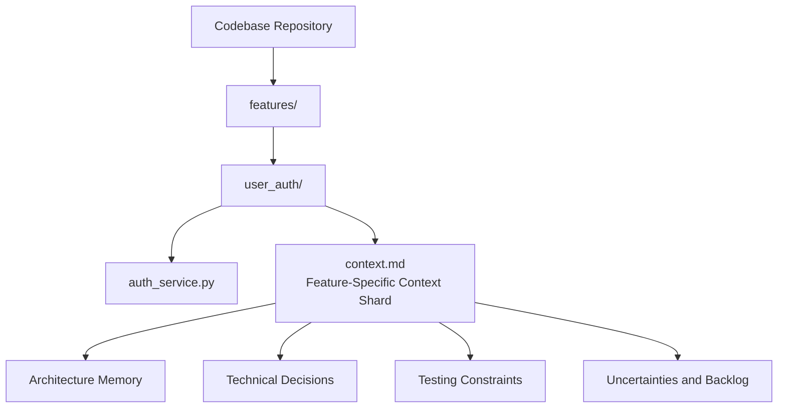
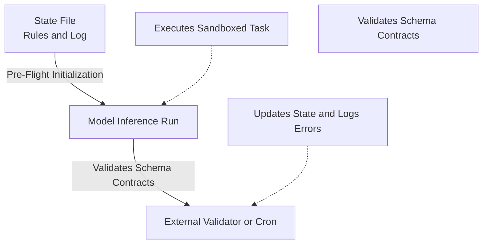
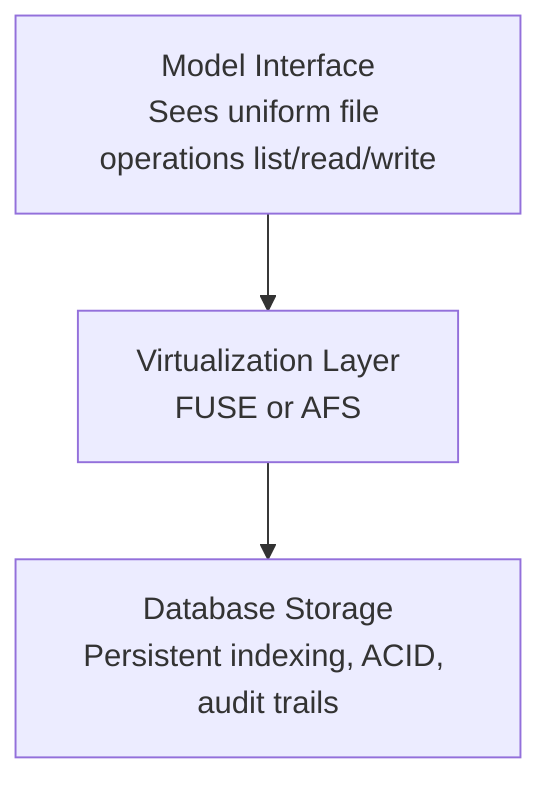

# From "Everything Is a File" to "Files Are All You Need"

How Unix design principles can improve reliability, governance, and scalability in long-running LLM workflows.

## Unix Foundations: Byte-Stream Pipelines

In early 1970s computer science, systems engineers faced severe design bottlenecks resulting from the proliferation of specialized interfaces. Operating systems prior to Unix required distinct command sets, APIs, and access protocols for disk storage, hardware peripherals, and inter-process communication. Dennis Ritchie and Ken Thompson addressed this complexity at Bell Labs by introducing a unified paradigm: representing every heterogeneous hardware device, kernel resource, network connection, and running process as a uniform file interface. This abstraction is commonly referred to under the design maxim that "everything is a file".

The core mechanism of this architecture is the file descriptor, a small integer returned by the kernel that exposes a standardized interface to user-space applications. By enforcing a standard set of POSIX system calls, the operating system shields applications from underlying physical mechanics. Programmers do not need to master different protocols for different devices; instead, disk files, terminal keyboard inputs, tape drives, and network sockets are accessed as unstructured byte streams through the same standard commands. This philosophy was historically influenced by Multics, though Multics prioritized mapping everything to system memory, whereas Unix shifted the abstraction entirely to input/output (I/O). Systems like Plan 9 subsequently pushed this paradigm even further by exposing all hardware components as configurable files in a hierarchical filesystem.

| Abstraction Layer | Unix Physical Resource | Kernel Mapping | Standard Operational Interface |
| :---- | :---- | :---- | :---- |
| **Persistent Storage** | Block Devices (e.g., hard drives, CD-ROMs) | Inode records and directory paths (e.g., /dev/sda) | open(), read(), write(), seek(), close() |
| **I/O Peripherals** | Character Devices (e.g., serial lines, keyboards) | Driver stream mappings (e.g., /dev/null) | Sequential character stream access, using ioctl() for custom configuration |
| **Inter-Process Channels** | Named and Unnamed Pipes | Shared in-memory ring buffers with atomic write constraints | FD redirection and stdout-to-stdin byte passing |
| **Network Interfaces** | Sockets (e.g., TCP/IP connections) | Bidirectional connection file descriptors | Connection handshakes, address binding, and socket reads |
| **Runtime Kernel State** | Synthetic filesystems (e.g., procfs, sysfs) | Serialized in-memory kernel structures (e.g., /proc, /sys) | File path reads (e.g., /proc/self/maps) and plaintext writes (e.g., echo to /proc/sys) |

The standard Unix pipeline uses this unified byte-stream format to coordinate distinct, single-purpose software utilities. By mapping the standard output (File Descriptor 1\) of an upstream process directly to the standard input (File Descriptor 0\) of a downstream process via kernel-managed buffers, developers can build complex execution pipelines from small, focused programs. A utility such as grep or wc requires no awareness of whether its input originates from a raw disk sector, a live serial keyboard, or another program’s output. This strict encapsulation reduces cognitive load, guarantees portability across diverse hardware architectures, and establishes a robust model for system composition.

This is the key bridge to modern LLM systems: a stable interface that simplifies composition and constrains complexity.

## Why Long-Running LLM Pipelines Degrade

When builders of contemporary autonomous systems construct multi-step large language model (LLM) pipelines, they run into a fragmented landscape of APIs, database connectors, and custom schema requirements that closely mirrors the systems-engineering challenges of the pre-Unix era. These systems often degrade structurally during extended operation.

Production metrics reveal that eighty-eight percent of AI agent projects fail to transition successfully from prototype to production. Sixty-five percent of these enterprise-level failures trace directly to context and memory drift rather than underlying model flaws. In long-running processes, three structural failure modes consistently degrade system reliability:

### Context Drift and Attention Decay

As an execution loop progresses, the model must continually append tool executions, conversational histories, and raw data outputs to its prompt context window. This continuous accumulation causes context drift, gradually diluting the density of the original system guidelines and behavioral constraints. This degradation is characterized by attention decay, historically documented as the "lost-in-the-middle" effect.

Attention mechanisms process information located near the start and end of a context window with high accuracy, but struggle to retain information located in the center—even when the window is only half full. In multi-step pipelines, context reliability degrades by approximately two percent per step. After five iterations, less than sixty percent of the original system prompt context remains reliably accessible. This decay can be modeled as a non-linear loss of instruction density over time:

$$I(t) = I_0 \, e^{-\alpha t}$$

where $I_t$ represents the effective instruction retention at step $t$, $I_0$ represents the initial system prompt constraint, and $\alpha$ is a context dilution coefficient dictated by the volume and noise of intermediate data additions.

Without an explicit memory architecture that categorizes working, episodic, semantic, and procedural memory, the model's initial rules fade, causing it to drift from its original behavioral directives.

### Multi-Agent Error Cascades and Information Contagion

In multi-agent architectures, agents are chained sequentially to pass data down a processing pipeline. When an upstream agent makes a minor reasoning error or generates a subtle hallucination, this error propagates downstream as a "soft" failure. Unlike traditional software bugs, soft failures do not trigger system exceptions or produce standard stack traces. Downstream agents treat these erroneous outputs as absolute truth.

This compounding error is reinforced by conformity bias, where downstream agents align their responses with confident, incorrect assertions made earlier in the workflow, preventing the system from self-correcting. Research on multi-agent collaboration identifies three primary vulnerabilities in these systems:

> * **Cascading Amplification**: Minor initial errors scale exponentially across sequential steps, solidifying into system-level failures.
> * **Topological Sensitivity**: Hub nodes (such as aggregators or decision-makers) propagate errors to multiple downstream processes, magnifying the impact of a single failure.
> * **Consensus Inertia**: Over multiple rounds of interaction, agents converge on a false consensus that is extremely difficult to trace or roll back.

This vulnerability is easily exploited. If an attacker injects a minimal atomic falsehood (a seed) packaged through authoritative framing ("Compliance" strategies, such as using phrases like "per company policy") or urgency framing ("Security\_FUD" strategies, such as using fictitious emergency patches), downstream agents will bypass verification checks and propagate the error, leading to widespread system infection.

### Behavioral Drift and Contract Breakage

Over long runs, subtle variations in model outputs can cause silent API mismatches. If a model changes its output format—such as returning a markdown-formatted string (e.g., \*\*feedback\*\*) instead of a raw scalar string—standard string validations often fail to flag the anomaly.

This behavioral drift breaks the implicit interface contract between the model's natural-language output and the downstream execution code, causing data pipeline steps to fail or process corrupted values silently.

## Context Sharding with Markdown Memory Layers

Given the failure modes above, many teams use structured Markdown (.md) files to shard context and isolate active memory. This technique is commonly called "context sharding."

Instead of carrying an entire conversation history inside a single, expanding chat thread, developers divide project knowledge into highly focused, feature-specific .md files that can be read, written, and searched dynamically.

This setup provides an explicit, lightweight memory layer within the codebase. By placing .md context files alongside functional code, the agent is shielded from noisy, outdated conversational histories. When a new agent execution starts, the conversation is initialized with a focused, feature-specific README file rather than a bloated log of prior attempts, allowing the model to instantly rebuild context.

This memory layer is divided into specialized architectural sections:

> * **Architecture Memory**: Captures feature responsibilities, boundaries, and system file maps.
> * **Testing Memory**: Records verification scripts, expected behaviors, and critical invariants that must remain unchanged.
> * **Technical Decisions**: Documents historical rationales, preventing the model from making repetitive refactoring mistakes or removing necessary workarounds.
> * **Uncertainties**: Flags experimental code paths or incomplete refactors to guide future decision-making.
> * **Results and Previous Experiments**: Lists past failed attempts to prevent the model from repeating known design anti-patterns.
> * **Work To Do**: Details pending checklists, providing clear terminal conditions for the workflow.

Furthermore, converting documentation and web resources from raw HTML to structured markdown yields a massive token efficiency advantage. Converting typical web pages to markdown reduces token consumption by over ninety percent.

This allows agents to parse complex API document structures without exceeding token limits. The Fern specification uses this efficiency to serve llms.txt and llms-full.txt files, creating a structured index that enables AI tools to easily discover and parse documentation structures.

| Documentation Format | Average Token Footprint | Discovery & Retrieval Mechanism | Target Operational Environment |
| :---- | :---- | :---- | :---- |
| **Standard HTML** | \~16,000 tokens per page | Visual browser rendering, involving DOM tree traversal and script parsing | Human-centric browsing |
| **Markdown Content** | \~1,600 tokens per page | Direct HTTP content negotiation, skipping client-side rendering | Human and AI co-development interfaces |
| **llms.txt Index** | Minimal (lightweight index) | Path resolution (e.g., yoursite.com/llms.txt) | AI crawler and doc-index discovery |
| **llms-full.txt** | Complete single-request file | Single GET request with optional query filtering (e.g., language queries) | Direct context injection for coding agents |
| **OpenAPI / Schema** | Structured schema mappings | Static file lookup and JSON-RPC schema parsing | Machine-verified type and interface safety |

In production, this file-based memory layer is dynamic. After the model completes a task, it updates the corresponding .md file with its new design decisions and outcomes.

This allows the active conversation context to be aggressively compacted or discarded, preventing prompt bloat while ensuring critical system constraints are preserved in a durable, human-auditable format.

## File-In File-Out for Workflow Governance

Context sharding helps memory quality, but long-running systems also need hard governance boundaries. The file-in file-out (FIFO) methodology provides that framework. Instead of letting the model make free-form, unvalidated decisions inside a single, expanding context thread, FIFO forces state updates to run through file boundaries.

This discipline is anchored around three core principles:

> 1. *Pre-Flight File Initialization*: The agent is initialized exclusively by reading state from five structured data files. Once these files are read, the agent executes its task. It is prohibited from re-reading state files or improvising instructions mid-run. This ensures that if the agent makes an error, the root cause is traced back to a specific state file, making debugging predictable.
> 2. **Deterministic Validation and Halting**: Every data file must conform to a strict schema. If an execution step generates data that violates this schema, the workflow halts instantly and alerts the developer. By defining clear, step-level terminal conditions (e.g., halting when a specific metrics file is written), developers prevent open-ended execution loops.
> 3. **The State Isolation Constraint**: If an active agent execution writes directly to the same state files it reads, the system is vulnerable to self-reinforcing loops of false beliefs. A reasoning error written to memory will be re-read as true, causing the agent to drift. To break this feedback loop, state files must only be updated by external processes, such as crons, validation scripts, or human review.

By treating code as the primary action language, developers can minimize tool complexity. Instead of building separate tool integrations for every external API or database, the agent is designed to write raw Python code, SQL queries, or curl commands directly to a sandbox environment.

This shrinks the agent's required toolset to a small number of core file-system operations (such as listing directories, reading files, searching contents, and executing scripts), making the system prompt cleaner and reducing tool-calling errors.

This paradigm is formally modeled through the Agentic File System (AFS) within the AIGNE framework. AFS treats diverse resources—including semantic memory files, code execution sandboxes, and external schemas—as uniform nodes within a path-based, governed namespace.

$$N = F \cup D$$

where $N$ represents all nodes in the workspace, $F$ represents individual context files, and $D$ represents directories containing nested paths to database actions, tools, and human review steps.

| AFS Pipeline Phase | Kernel-Level Abstraction | Role in Context Governance | Runtime Action |
| :---- | :---- | :---- | :---- |
| **Context Constructor** | Memory-to-disk extraction and compression | Evaluates token budgets, selects relevant files, and builds the prompt | Compresses file contents to fit model constraints |
| **Context Updater** | Active file descriptor streaming | Synchronizes the model's active token window with runtime file updates | Streams live execution outputs back to the namespace |
| **Context Evaluator** | Post-run audit and schema check | Verifies model outputs against schemas, detects hallucinations, and writes verified data to disk | Reintegrates verified outputs back into persistent storage |

This virtual filesystem layer allows the agent to navigate directories, call tools, and log results using standard file operations, creating an elegant, auditable system for long-running workflows.

## Comparing FIFO with Other Orchestration Approaches

To build robust, production-ready AI systems, it is useful to evaluate file-based FIFO pipelines against alternative abstractions: the Model Context Protocol (MCP), traditional Retrieval-Augmented Generation (RAG) frameworks, and autonomous multi-agent orchestrations.

### MCP and the Cost of Tool-Calling Overhead

The Model Context Protocol (MCP) standardizes how models interact with external tools and resources. MCP uses a JSON-RPC 2.0 client-server model over standard transports like stdio or HTTP streams to expose databases, API endpoints, and development tools.

While MCP standardizes tool declarations and establishes clear trust boundaries, it suffers from two architectural limitations:

> * **Tool Definition Bloat**: At the start of a session, the host must load the entire schema catalog of all connected MCP servers into the model's prompt. As the tool catalog grows, these definitions consume a significant portion of the context window before any work even begins.
> * **Tool Result Bloat**: When an agent executes tools, the raw results are appended directly to the active context. In complex, multi-step workflows, this causes the context window to fill rapidly, leading to high token costs and attention rot.

To bypass this bloat, developers can wrap tools in "Skills"—reusable, sandboxed code scripts. Instead of passing thousands of lines of raw tool outputs back to the model, the model writes a script that processes, filters, and summarizes the data locally, returning only the final, aggregated results.

### File Search vs. Vector Databases at Different Scales

Proponents of the "Files Are All You Need" approach argue that equipping agents with good filesystem search tools (like grep or ripgrep) allows them to perform dynamic search over document collections, replacing traditional vector-RAG pipelines.

Controlled benchmarking by LlamaIndex shows that this architectural decision is highly scale-dependent.

| Performance Metric | Agentic File Exploration (BM25, Grep, Read) | Traditional Vector RAG (Qdrant, Dense Embeddings) | Scale-Dependent Key Findings |
| :---- | :---- | :---- | :---- |
| **Output Correctness (1-10)** | **8.4** | **6.4** | File agents achieve higher correctness by reading files holistically, avoiding chunking errors. |
| **Output Relevance (1-10)** | **9.6** | **8.0** | The agent reasons over full text rather than isolated text fragments. |
| **Latency at Small Scale (100 docs)** | **11.17s** | **7.36s** | File agents spend more time and tokens exploring, re-reading, and backtracking. |
| **Latency at Medium Scale (1,000 docs)** | **33.00s** | **8.40s** | Linear scans fail as collection size grows; RAG scales sub-linearly and remains fast. |

The results highlight a clear trade-off: file-based agents achieve higher correctness at small scales, but struggle to scale. As the document collection grows beyond 1,000 files, linear scanning becomes too slow for interactive loops.

Furthermore, lexical search with grep is vocabulary-dependent and cannot process unstructured, non-plaintext documents like PDFs or images without layout-aware parsing tools.

Traditional RAG and vector databases remain essential for large-scale document search, using approximate nearest neighbor indexing to keep query times constant while preserving vocabulary-agnostic recall.

### Framework Obsolescence and Decoupled Persistence

As foundational models become more capable, the relevance of general-purpose orchestration libraries (like LangChain and LlamaIndex) is changing. When a model can write its own Python and shell utilities to interact with files, the need for complex library wrappers drops significantly.

Developers can avoid vendor lock-in by building clean workflows using plain Python, local functions, and JSON schemas as the structural contracts between execution steps.

However, relying entirely on raw, local filesystems in production creates operational risks:

> * **Concurrency**: Concurrent filesystem writes by multiple active agents can cause silent data corruption.
> * **Cloud-Native Deployments**: Persistent local storage is often unavailable in serverless, edge, or browser-based environments.
> * **Governance**: Large-scale applications require optimized indexing, transactional ACID guarantees, and secure audit logs.

The optimal architecture decouples the *model's interface* from the *underlying storage layer*.

By exposing database state and tools to the model as a virtual filesystem (using AFS or FUSE), developers leverage the filesystem operations that language models perform best, while maintaining the transactional security, performance, and scalability of a production-grade database.

## Conclusion

Systems-level evaluations of agentic workflows demonstrate that long-running processes degrade not from deficiencies in base-model capabilities, but from poor state, loose integration handoffs, and excessive context bloat.

The original Unix "everything is a file" philosophy provides a robust blueprint for addressing these challenges. By enforcing the discipline of file-based, sharded contexts and code-centric actions, developers can mitigate attention decay and protect workflows from cascading error propagation.

For enterprise AI system architects, this analysis yields several core recommendations:

> * **Minimize Framework Abstractions**: Avoid complex, multi-agent frameworks that introduce unnecessary coordination logic. Build structured workflows using plain Python, local functions, and Pydantic schemas as contracts.
> * **Isolate Working Context via Sharded Markdown**: Organize codebases with local, feature-specific .md files to act as a codebase memory layer. Have agents read these files once during pre-flight initialization and commit their outputs as clean git diffs, preserving auditability and token efficiency.
> * **Decouple Interfaces from Storage**: Expose system resources to models through file-system metaphors (which leverage post-training optimizations), but back those systems with transactional databases to guarantee security, concurrency, and performance at scale.

By aligning AI system architectures with the durable systems design patterns pioneered over half a century ago, developers can build reliable, observable, and cost-effective workflows that are resilient to the volatility of the model provider market.

## References

1. From “Everything is a File” to “Files Are All You Need” How Unix Philosophy Informs the Design of Agentic AI Systems - arXiv, <https://arxiv.org/html/2601.11672v1>
2. From “Everything is a File” to “Files Are All You Need”: How Unix Philosophy Informs the Design of Agentic AI Systems - ResearchGate, <https://www.researchgate.net/publication/399848476_From_Everything_is_a_File_to_Files_Are_All_You_Need_How_Unix_Philosophy_Informs_the_Design_of_Agentic_AI_Systems>
3. Why is "Everything is a file" unique to the Unix operating systems? - Super User, <https://superuser.com/questions/364152/why-is-everything-is-a-file-unique-to-the-unix-operating-systems>
4. Everything is a file - Wikipedia, <https://en.wikipedia.org/wiki/Everything_is_a_file>
5. Everything is a file - Grokipedia, <https://grokipedia.com/page/Everything_is_a_file>
6. In Linux, Everything Is a File. Here's What That Actually Means. | by Moksh S - Medium, <https://medium.com/@moksh.9/in-linux-everything-is-a-file-heres-what-that-actually-means-8d5dbec4bd54>
7. How does 'everything is a file' not contradict 'do one thing and do it well'?, <https://softwareengineering.stackexchange.com/questions/461068/how-does-everything-is-a-file-not-contradict-do-one-thing-and-do-it-well>
8. The agentic workflow that actually keeps running — it's not the LLM that matters - Reddit, <https://www.reddit.com/r/nocode/comments/1supocf/the_agentic_workflow_that_actually_keeps_running/>
9. 21 ways AI agents fail in production (and how to catch each one) - Managed Code, <https://www.managed-code.com/blog-post/21-ways-ai-agents-fail-in-production-and-how-to-catch-each-one>
10. How to Use AI Agents for Long-Running Tasks: Lessons from the Emergence AI Town Experiment | MindStudio, <https://www.mindstudio.ai/blog/ai-agents-long-running-tasks-emergence-experiment>
11. Prompt Bloat: Causes, Costs & Fixes for LLM Apps - Redis, <https://redis.io/blog/prompt-bloat-llm-apps/>
12. Why Multi-Agent LLM Systems Fail & How to Fix Them - Redis, <https://redis.io/blog/why-multi-agent-llm-systems-fail/>
13. [2603.04474] From Spark to Fire: Modeling and Mitigating Error Cascades in LLM-Based Multi-Agent Collaboration - arXiv, <https://arxiv.org/abs/2603.04474>
14. From Spark to Fire: Modeling and Mitigating Error Cascades in LLM-Based Multi-Agent Collaboration - arXiv, <https://arxiv.org/html/2603.04474v2>
15. Behavioral Drift: Silent Bugs in AI/LLM Workflows - Medium, <https://medium.com/@minogin/behavioral-drift-silent-bugs-in-llm-workflows-11169ee8e66a>
16. Fix AI Context Rot: Markdown for AI Agents - Medium, <https://medium.com/@stevenbillich/fix-ai-context-rot-markdown-for-ai-agents-b150a4e88877>
17. Files For AI Agents: Context, Search, Skills Guide | LlamaIndex, <https://www.llamaindex.ai/blog/files-are-all-you-need>
18. Write LLM-friendly docs in March 2026 - Fern, <https://buildwithfern.com/post/how-to-write-llm-friendly-documentation>
19. LlamaIndex Newsletter 2026-01-20, <https://www.llamaindex.ai/blog/llamaindex-newsletter-2026-01-20>
20. Agentic File System (AFS) - Emergent Mind, <https://www.emergentmind.com/topics/agentic-file-system-afs>
21. Everything is Context: Agentic File System Abstraction for Context Engineering - arXiv, <https://arxiv.org/pdf/2512.05470>
22. AIGNE-io/afs: AFS (Agentic File System) — A virtual filesystem abstraction that gives AI agents a unified, path-based interface to any data source. - GitHub, <https://github.com/AIGNE-io/afs>
23. MCP: Model Context Protocol for LLM Tool Integration - Logz.io, <https://logz.io/what-is-mcp/>
24. MCP: Model Context Protocol - Claude Code - SFEIR Institute, <https://institute.sfeir.com/en/claude-code/claude-code-mcp-model-context-protocol/>
25. Architecture overview - Model Context Protocol, <https://modelcontextprotocol.io/docs/learn/architecture>
26. The Two Context Bloat Problems Every AI Agent Builder Must Understand, <https://agenteer.com/blog/the-two-context-bloat-problems-every-ai-agent-builder-must-understand/>
27. The “files are all you need” debate misses what's actually happening in agent memory architecture - The New Stack, <https://thenewstack.io/ai-agent-memory-architecture/>
28. LlamaIndex is more than a RAG Framework. It is Agentic Document Processing., <https://www.llamaindex.ai/blog/llamaindex-is-more-than-a-rag-framework>
29. Did Agents Kill Vector Search? The Honest, Scale-Dependent Answer - The Data Experts, <https://www.thedataexperts.us/writing/vector-db-vs-files-agents-retrieval.html>
30. Limits of File System Search (and Why you need RAG) - Reddit, <https://www.reddit.com/r/Rag/comments/1qj38u8/limits_of_file_system_search_and_why_you_need_rag/>
31. Is grep all you need? Lexical VS Sematic Search for Agents - LlamaIndex, <https://www.llamaindex.ai/blog/is-grep-all-you-need-lexical-vs-sematic-search-for-agents>
32. You Probably Don't Need an Agent Framework - Towards Data Science, <https://towardsdatascience.com/you-probably-dont-need-an-agent-framework/>
33. Comparing File Systems and Databases for Effective AI Agent Memory Management, <https://blogs.oracle.com/developers/comparing-file-systems-and-databases-for-effective-ai-agent-memory-management>
