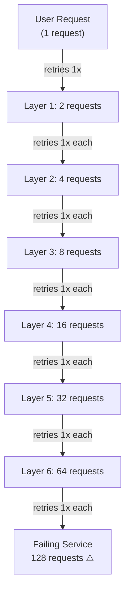
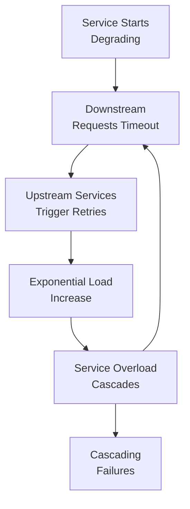

# Why Retries Quietly Turn Into Outages

Every service in a call chain thinks it's being responsible. When a downstream request fails, it retries — once, maybe twice — before giving up. Locally, this looks like good engineering: a network blip, a slow database, or a dropped packet often resolves on retry. The user never notices.

The problem is that **"locally reasonable" doesn't stay local**. In a chain of services calling services, retries don't add up — they **multiply exponentially**.

## How Exponential Amplification Works

Imagine seven services in a call chain: A → B → C → D → E → F → G

**Without failures:** A single user request results in one request at each hop. Straightforward.

**With a failing downstream (G):** Every service retries once on failure:

- **F** calls G, it fails, F retries → **2 requests to G**
- **E** calls F. Since F might fail and retry, E sees up to 2 failures, so E retries → **up to 4 requests to F**
- **D** calls E with similar logic → **up to 8 requests to E**
- By the time the request chain reaches the top, **one user request has become 128 requests hammering the struggling service at the bottom**

If each hop retries **R** times and the chain is **d** layers deep:

$$\text{Amplified Requests} = R^d$$

A single retry (R=1) across 7 layers (d=7) creates **2^7 = 128x traffic**. This isn't a linear cost — it's exponential. Depth is the multiplier.

## The Compounding Problem

Two mechanisms make this more than just "extra load":

**Traffic hits the weakest link hardest.** The amplified load lands hardest on the service that's already struggling. It's failing *because* it's overloaded, degraded, or its database is exhausted — and the chain's response is to send it exponentially more requests, right when it can least handle them. This is catastrophic feedback: retries aimed at a failing service don't fix it; they accelerate its collapse.

**The retry storm creates a positive feedback loop.** More retries cause more load, more load causes slower responses and more timeouts, more timeouts trigger more retries. A single minor degradation deep in the stack can transform into a full-stack outage in minutes.

## Why It Stays Hidden

This problem is invisible to individual teams for two reasons:

**Siloed configuration.** Nobody designs exponential retry amplification on purpose. Each team configures retries for *their own service* in isolation, and each choice is defensible locally. The exponential blowup only shows up when you examine the entire call chain. Most engineers configuring retry logic for their one service have no visibility into how many layers sit above or below them, or how their retry setting interacts with everyone else's. The failure mode is a property of the *system*, not of any single service's code.

**Error ambiguity.** Not every error means the same thing. A service might fail because *it broke* (internal error, crashed process) or because *something it called broke* and it's passing the failure along (transient downstream failure). Retrying makes sense in the first case and can be actively harmful in the second — cascading retries on a system that's already failing just wastes precious request budget on a problem that won't resolve with another attempt. But from the caller's point of view, both errors look identical: "downstream returned a failure." Without visibility into the *cause*, retry logic treats all failures identically, which amplifies the problem.

## How to Fix It

None of this means "don't retry." It means retries need to be **aware of where they sit in the chain** and what they're actually accomplishing. Several strategies address this:

**Retry budgets** cap retries as a *percentage of traffic* rather than a fixed count per hop. This prevents the multiplier from compounding freely — if you budget 10% of requests as retries, that's the system-wide ceiling, not per-layer.

**Backoff and jitter** space retries out and stagger them so failures don't all hammer the downstream service in synchronized waves. Exponential backoff with random jitter reduces thundering herd effects.

**Circuit breakers** stop retrying entirely once a downstream's failure rate crosses a threshold. Rather than hoping the next attempt gets lucky, they acknowledge the service is broken and fail fast, letting upstream handle the decision about what to do next.

**Error ownership** (Uber's approach) distinguishes between services that *cause* an error and services that *propagate* an error they didn't create. Only retry at the layer responsible for the error. This prevents cascading retries on problems originating elsewhere.

**Deadline propagation** passes a single time budget down the entire call chain. Retries stop automatically once it's too late for the response to matter anyway. No point retrying when the client has already timed out waiting.

## The Takeaway

A retry isn't a local decision — **it has a blast radius, and that radius grows exponentially with depth.**

In deep call chains, the engineering principle "be conservative and retry" is actually dangerous without guardrails. Effective distributed systems require visibility into the full chain and explicit mechanisms to prevent retry storms from cascading through the stack.

## Reference

This article was inspired by Uber's work on retry storms:

[Protecting Against Retry Storms](https://www.uber.com/us/en/blog/protecting-against-retry-storms/)